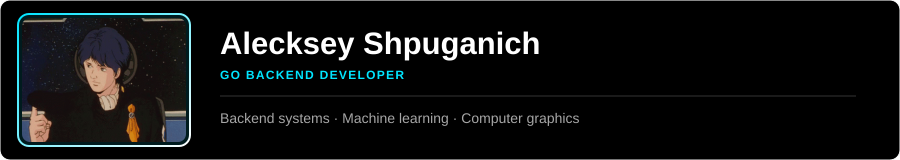
<table>
  <tr>
    <td width="50%"></td>
    <td width="50%"></td>
  </tr>
  <tr>
    <td width="50%"></td>
    <td width="50%"></td>
  </tr>
</table>
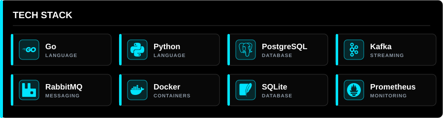

<a href="https://github.com/venexene">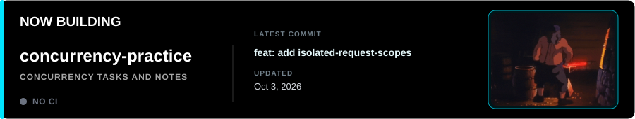</a>

<table>
  <tr>
    <td width="50%"></td>
    <td width="50%">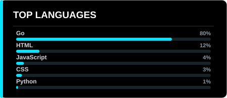</td>
  </tr>
</table>

<table>
  <tr>
    <td width="50%" valign="top">
      <a href="https://github.com/venexene/gorder">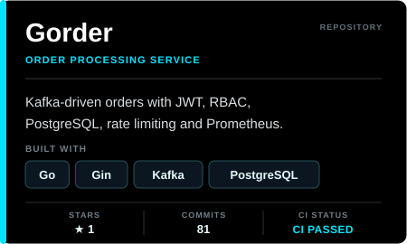</a>
    </td>
    <td width="50%" valign="top">
      <a href="https://github.com/venexene/goracle">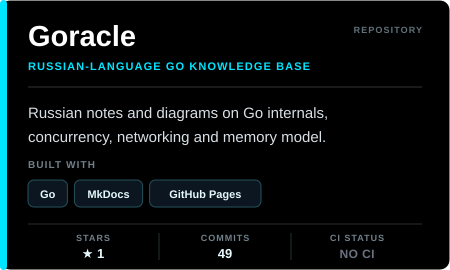</a>
    </td>
  </tr>
  <tr>
    <td width="50%" valign="top">
      <a href="https://github.com/venexene/temgo">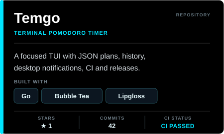</a>
    </td>
    <td width="50%" valign="top">
      <a href="https://github.com/venexene/nango">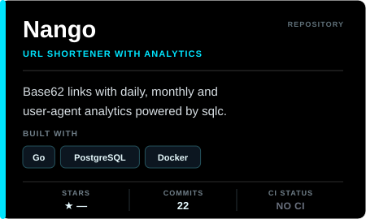</a>
    </td>
  </tr>
  <tr>
    <td width="50%" valign="top">
      <a href="https://github.com/venexene/gonsai">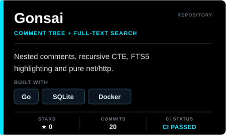</a>
    </td>
    <td width="50%" valign="top">
      <a href="https://github.com/venexene/gong">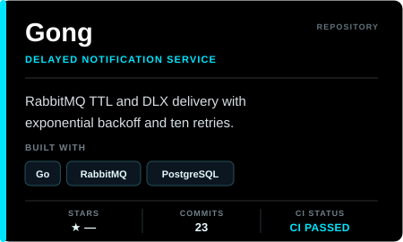</a>
    </td>
  </tr>
</table>

<table>
  <tr>
    <td width="50%" valign="top">
      <a href="https://github.com/venexene/algorithms-practice">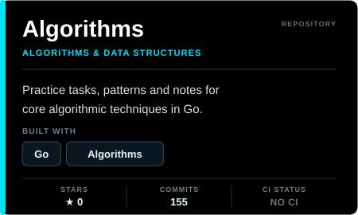</a>
    </td>
    <td width="50%" valign="top">
      <a href="https://github.com/venexene/sql-practice">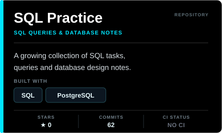</a>
    </td>
  </tr>
  <tr>
    <td width="50%" valign="top">
      <a href="https://github.com/venexene/concurrency-practice">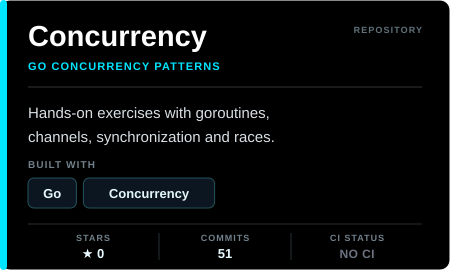</a>
    </td>
    <td width="50%" valign="top">
      <a href="https://github.com/venexene/backend-practice">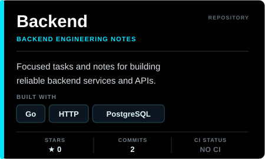</a>
    </td>
  </tr>
</table>

<table>
  <tr>
    <td width="50%" valign="top">
      <a href="https://github.com/Rcinderblock/document-element-detector">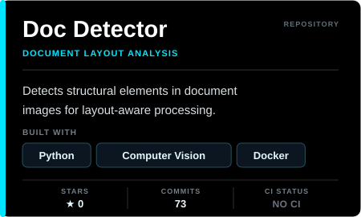</a>
    </td>
    <td width="50%" valign="top">
      <a href="https://github.com/venexene/voice-commands-recognition">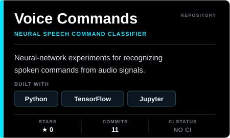</a>
    </td>
  </tr>
  <tr>
    <td width="50%" valign="top">
      <a href="https://github.com/venexene/GANImgGen">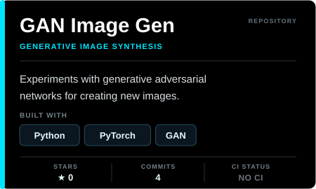</a>
    </td>
    <td width="50%" valign="top">
      <a href="https://github.com/venexene/imdb-classification">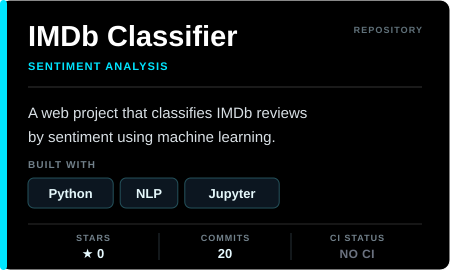</a>
    </td>
  </tr>
</table>
